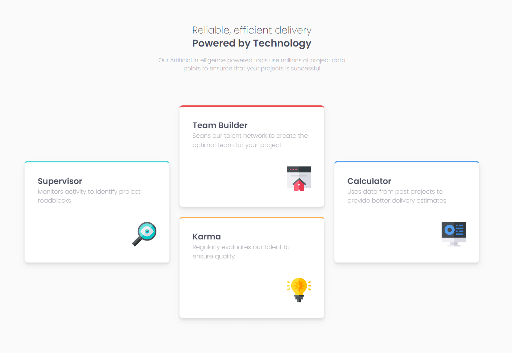

# Frontend Mentor - Four card feature section solution

This is a solution to the [Four card feature section challenge on Frontend Mentor](https://www.frontendmentor.io/challenges/four-card-feature-section-weK1eFYK). Frontend Mentor challenges help you improve your coding skills by building realistic projects.

## Table of contents

- [Overview](#overview)
  - [The challenge](#the-challenge)
  - [Screenshot](#screenshot)
  - [Links](#links)
- [My process](#my-process)
  - [Built with](#built-with)
  - [What I learned](#what-i-learned)
- [Author](#author)

## Overview

### The challenge

Users should be able to:

- View the optimal layout for the site depending on their device's screen size

### Screenshot



### Links

- Live Site URL: [Add live site URL here](https://your-live-site-url.com)

## My process

### Built with

- Semantic HTML5 markup
- Flexbox
- CSS Grid
- Mobile-first workflow
- [React](https://reactjs.org/) - JS library
- [Next.js](https://nextjs.org/) - React framework
- [TailwindCSS](https://tailwindcss.com) - CSS Utility Framework

### What I learned

In this challenge I learned to use CSS Grid for the desktop version of the four card feature section. The alignment in the mobile view is done with flexbox. I created a reusable component (card) with the necessary props:

- title: Headline of the card
- description: the description or sub-headline
- className: for additional css classes
- icon: the svg icon
- variant: the color of the (top) border, this is done via a Map:

```jsx
const borderVariant = new Map([
  ["cyan", "border-cyan"],
  ["red", "border-red"],
  ["orange", "border-orange"],
  ["blue", "border-blue"],
]);
```

in the className I get the variant with the following getter:

```jsx
borderVariant.get(variant);
```

The value (for exmaple cyan: border-cyan) set the (top) border color.

## Author

- Website - [schman](https://challenges.schman.dev)
- Frontend Mentor - [@schmanat](https://www.frontendmentor.io/profile/schmanat)
